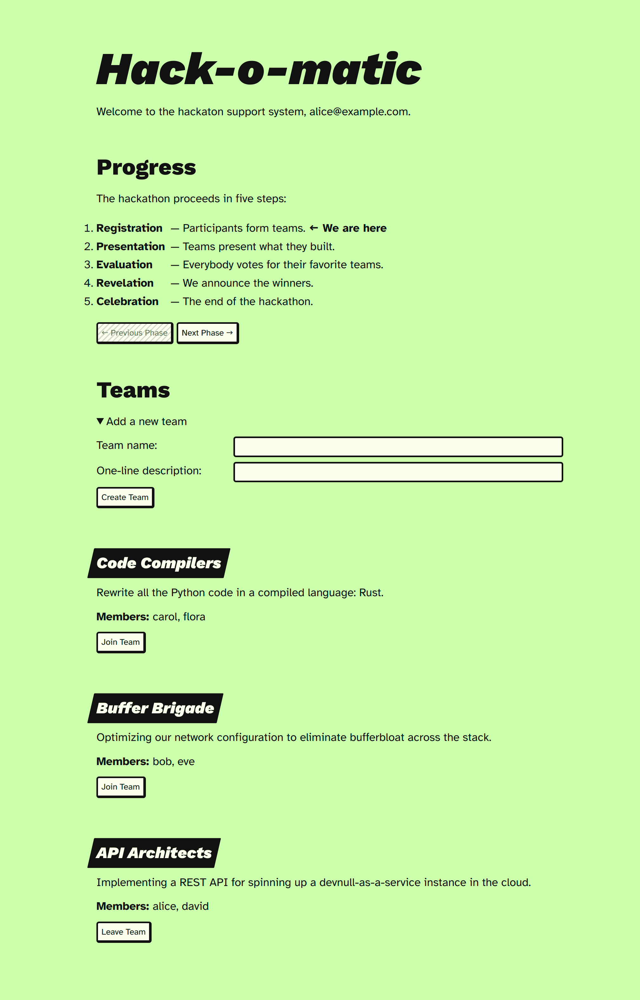
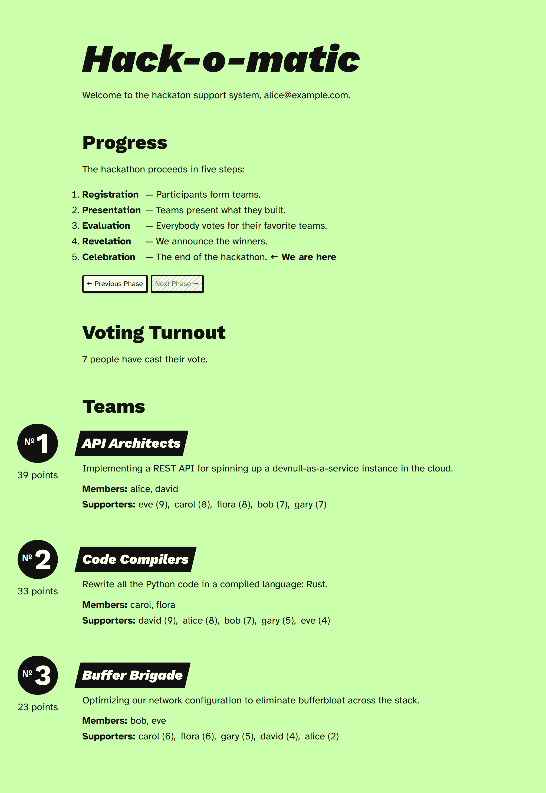

# Hack-o-matic

The Hack-o-matic is a simple webapp that facilitates remote and on-site
hackathons. It handles team registration, quadratic voting, and presenting the
outcome of the vote. It needs an external system such as [OAuth2 Proxy][o2proxy]
for user management and authentication.

 

A hackathon has the following phases:

 * **Registration** — Any user can start a team. Teams have a name and short
   description. Users can also join teams that others have created.
 * **Presentation** — At this point teams can no longer be changed. In this
   phase teams can present what they built.
 * **Evaluation** — Any user (also those not in a team) can cast their vote.
   Users cannot vote for teams that they are a member of. The voting system
   is [quadratic voting][quadratic]. Although it is not the simplest system,
   it worked out well at Chorus One.
 * **Revelation** — The admin can see the outcome of the vote, but it is still
   hidden from regular users. The teams are sorted with the winner at the bottom
   of the page. This enables the admin to present their screen and simply scroll
   down to reveal the winners. All of the votes are public.
 * **Celebration** — At this point every user can view the outcome of the vote,
   and teams are sorted by descending points, with the winner at the top of the
   page.

[quadratic]: https://en.wikipedia.org/wiki/Quadratic_voting

## Building

The Hack-o-matic is written in Rust and builds with Cargo:

    cargo build --release
    target/release/hackomatic hackomatic.toml

## Deploying

The binary starts a webserver that listens on the [configured](#configuration)
port. This webserver is expected to be protected by a reverse-proxy that sets
the `X-Email` header. The reverse proxy should handle authentication and
authorization. This is a convenient way to ensure that all people in your
organization can join and vote without having to create an account anywhere.

One possible setup is to use Nginx and [OAuth2 Proxy][o2proxy]. To make OAuth2
Proxy pass the user’s email address, enable the `--set-xauthrequest` option.
The documentation [contains an example][o2-nginx] for how to configure Nginx to
set the `X-Email` header when using `auth_request`.

The Hack-o-matic stores all data in a SQLite database. To start a new hackathon,
simply change the database file in the configuration. To back up a database, one
convenient way is to use [`VACUUM INTO`][vacuum]:

    $ sqlite3 hackomatic.sqlite3
    sqlite> VACUUM INTO 'hackomatic-backup.sqlite3';

[o2proxy]:  https://oauth2-proxy.github.io/oauth2-proxy/
[o2-nginx]: https://oauth2-proxy.github.io/oauth2-proxy/configuration/overview#configuring-for-use-with-the-nginx-auth_request-directive
[vacuum]:   https://sqlite.org/lang_vacuum.html

## Configuration

There is a single toml configuration file. See `hackomatic.toml` for an example.
See `src/config.rs` for documentation of the fields.

For local testing where no reverse proxy to set the `X-Email` header is
available, you can set `debug.unsafe_default_email` to an email address that
will be used when no `X-Email` header is present. This feature is of course
unsafe to use in production.

## License

The Hack-o-matic is licensed under the Apache 2.0 License. A copy of the license
is included in the root of the repository.
